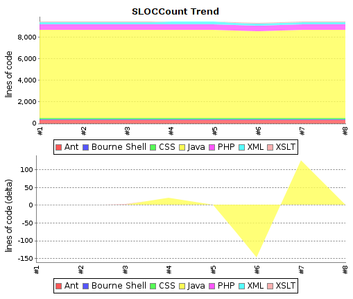

# SLOCCount Plugin

This plug-in generates trend report for [SLOCCount](http://www.dwheeler.com/sloccount/) and [cloc](http://cloc.sourceforge.net/) open source tools, that count number of code lines written in many programming languages.

## Description

The SLOCCount plug-in scans for [SLOCCount](http://www.dwheeler.com/sloccount/) or [cloc](http://cloc.sourceforge.net/) report files in the build workspace directory and reports the number of lines they found.

The following features are provided by this plug-in:

- Parsing of reports generated by [SLOCCount](http://www.dwheeler.com/sloccount/) tool.
- Parsing of reports generated by [cloc](http://cloc.sourceforge.net/) tool.
- Configuration of the files to scan after a build.
- Trend reports showing the number of lines per language.
- Trend reports showing the number of added or deleted lines per language.
- Overview of the lines per file, folder or language.
- [Dashboard View](https://wiki.jenkins.io/display/JENKINS/Dashboard+View) portlet showing number of lines, files and languages per job.
- Remote access API ([REST API](https://wiki.jenkins-ci.org/display/JENKINS/Remote+access+API)).
- Works with any project/job type.

This plug-in is developed and maintained by Nicolas Piguet. Please use
the [Mailing Lists](https://wiki.jenkins.io/display/JENKINS/Mailing+Lists)
or [issue tracker](http://issues.jenkins-ci.org/) to ask questions,
create feature request or bug reports, since I don't read the comment
section on this page regularly.

## Usage

If you are not sure which type of report files to use, prefer **cloc**.
It is able to detect more programming languages than SLOCCount (Scala,
Ant, CSS, ...) and is able to count also lines with comments that often
contain Javadoc or Doxygen documentation. Cloc is also better portable,
SLOCCount requires [cygwin](https://www.cygwin.com/) or similar
environment under MS Windows.

**Never switch between SLOCCount and cloc inside one job.** You would
end up with messy trend graph because they name programming languages
differently. Delete all affected builds and rebuild the job in such case
to fix the issue.

### Linux

- Install [SLOCCount](http://www.dwheeler.com/sloccount/) or [cloc](http://cloc.sourceforge.net/) on the build slave machine. Note they may be present in package repository of your distribution.
    - Debian, Ubuntu, ...
        - `apt-get install sloccount`
        - `apt-get install cloc`
    - Red Hat, CentOS, Fedora, ...
        - `yum install sloccount`
        - `yum install cloc`
- For each job configuration page:
    - Add a **execute shell** build step to generate the report files, or create them in your build scripts (Ant, Maven, Make, ...).
        - `sloccount --duplicates --wide --details [source-folder] > [output-folder]/sloccount.sc`
        - `cloc --by-file --xml --out=[output-folder]/cloc.xml [source-folder]`
    - Activate the checkbox **Publish SLOCCount analysis results** and provide the path to the generated report files.

### Windows

#### cloc

- Download and install [cloc](http://cloc.sourceforge.net/) ([cloc.exe](http://sourceforge.net/projects/cloc/files/cloc/)) on the build slave machine. Optionally if you have Perl installed, you can run cloc as a standalone Perl Script.
- For each job configuration page:
    - Generate the report files
        - `cloc.exe --by-file --xml --out=[output-folder]/cloc.xml [source-folder]`
        - `perl cloc.pl --by-file --xml --out=[output-folder]/cloc.xml [source-folder]`
    - Activate the checkbox **Publish SLOCCount analysis results** and provide the path to the generated cloc report.

#### SLOCCount

Since SLOCCount does not run on a native Windows machine the setup for
Windows requires additional steps. Most of the setup is explained in
detail in the [SLOCCount
documentation](http://www.dwheeler.com/sloccount/sloccount.html).

- Install [Cygwin](https://www.cygwin.com/) on the build slave.
- Compile and install SLOCCount within the Cygwin environment.
- For each job configuration page:
    - Add a build step to run Cygwin and SLOCCount. See the ANT example below to learn how to start Cygwin and run SLOCCount from an ANT script.
        - `/usr/bin/sloccount --duplicates --wide --details [source-folder] >[output-folder]/sloccount.sc` You must convert Windows paths that are passed as parameters to SLOCCount utility to Linux/Cygwin style (C:\\ becomes /cygdrive/c/).
    - Convert the SLOCCount results in sloccount.sc back to windows paths.
    - Activate the checkbox **Publish SLOCCount analysis results** and provide the path to the generated SLOCCount report.

If you uses sloccount for multiple jobs sometimes two jobs end at the
same time and sloccount is executed simultaneously. This will fail since
SLOCCount (by default) uses one temp data folder in $HOME/.slocdata.

Either change sloccount to not use a temp data directory or change the
setup explanation so novice users (like me) are explained to use the
--datadir option in order to get a datadir per hudson job.

This seems to work:
\[ -d slocdata \] \|\| mkdir slocdata
sloccount --datadir slocdata --details "your source path" \>
sloccount.sc

##### ANT example for Windows build

The target converts Windows paths to Linux style cygdrive paths (C:\\
becomes /cygdrive/c/) before SLOCCount runs. The converted paths are
passed as environment variables to Cygwin. After SLOCCount has been
executed, the results in sloccount.sc are converted back to windows
paths.

##### ANT target

Add this target to your Jenkins build:

**build.xml**

```xml
<target name="sloccount" depends="createAllSrc">
  <script language="javascript"> <![CDATA[
    function winToCygdrivePath(cygProp, winProp) {
      winPath = project.getProperty(winProp);
      cygPath = winPath.replaceAll("C:", "/cygdrive/c").replace('\\', '/');
      project.setProperty(cygProp, cygPath);
    }
    winToCygdrivePath("cygdrive.workspace.dir", "dir.workspace");
    winToCygdrivePath("cygdrive.allsrc.dir", "dir.allsrc");
    winToCygdrivePath("cygdrive.build.scripts.dir", "dir.build.scripts");
  ]]></script>

  <exec executable="${cygwin.bin}\bash.exe">
    <arg line="-li '${cygdrive.build.scripts.dir}/cygwin_sloccount.sh'" />
    <env key="SLOCCOUNT_SOURCE_DIR" value="${cygdrive.allsrc.dir}" />
    <env key="SLOCCOUNT_OUTPUT_DIR" value="${cygdrive.workspace.dir}" />
  </exec>

  <replace file="${dir.workspace}/sloccount.sc" token="/cygdrive/c" value="C:" />
  <replace file="${dir.workspace}/sloccount.sc" token="/" value="\" />
</target>
```

You may have to adjust the paths used in the snippet, if your Jenkins
workspace is on another drive than C.

##### Shell script

This shell script is called by Cygwin / ANT.

**cygwin\_sloccount.sh**

```
sloccount --duplicates --wide --details "$SLOCCOUNT_SOURCE_DIR" > "$SLOCCOUNT_OUTPUT_DIR/sloccount.sc"
```

## Remote access API ([REST API](https://wiki.jenkins-ci.org/display/JENKINS/Remote+access+API))

Use the URLs below to access the SLOCCount specific data.

Description of possibilities

- [http://SERVER/job/JOB\_NAME/BUILD\_NUMBER/sloccountResult/api](http://server/job/JOB_NAME/BUILD_NUMBER/sloccountResult/api)

Data

- [http://SERVER/job/JOB\_NAME/BUILD\_NUMBER/sloccountResult/api/xml](http://server/job/JOB_NAME/BUILD_NUMBER/sloccountResult/api/xml)
- [http://SERVER/job/JOB\_NAME/BUILD\_NUMBER/sloccountResult/api/xml?depth=1](http://server/job/JOB_NAME/BUILD_NUMBER/sloccountResult/api/xml?depth=1)
- [http://SERVER/job/JOB\_NAME/BUILD\_NUMBER/sloccountResult/api/json](http://server/job/JOB_NAME/BUILD_NUMBER/sloccountResult/api/json)
- [http://SERVER/job/JOB\_NAME/BUILD\_NUMBER/sloccountResult/api/json?depth=1](http://server/job/JOB_NAME/BUILD_NUMBER/sloccountResult/api/json?depth=1)
- etc.

Example of XML data:

```xml
<sloccountReportStatistics>
    <language>
        <files>7</files>
        <lines>513</lines>
        <name>xml</name>
    </language>
    <language>
        <files>116</files>
        <lines>8174</lines>
        <name>java</name>
    </language>
    <totalFiles>123</totalFiles>
    <totalLanguages>2</totalLanguages>
    <totalLines>8687</totalLines>
</sloccountReportStatistics>
```

Example of JSON data:

```json
{
    "languages":
    [
        {"files":7,"lines":513,"name":"xml"},
        {"files":116,"lines":8174,"name":"java"},
    ],
    "totalFiles":123,
    "totalLanguages":2,
    "totalLines":8687
}
```

## Support for cloc tool

Parsing of cloc XML reports is supported natively in the plugin from
version 1.20.

[Cloc](http://cloc.sourceforge.net/) (Count Lines of Code) is a tool
similar to SLOCCount. It provides output to a XML file that can be
simply transformed to the SLOCCount format and used in this plugin. Cloc
is written in Perl and should be better portable than SLOCCount.

This howto was created and tested on Debian GNU/Linux, Jenkins 1.447,
SLOCCount plugin 1.12, cloc 1.60 and xsltproc 1.1.28.

#### Install cloc and xsltproc

Download cloc from <http://cloc.sourceforge.net/> and install it. You
need also a whatever tool for XML transformations (xsltproc used) or you
can try [clokins](https://gitorious.org/clokins) tool (not tested at
all). You can install the packages present in your GNU/Linux
distribution.

```
# Debian/Ubuntu specific
apt-get install cloc xsltproc
```

#### Script for XSLT transformation

Copy-paste the script below and store it to cloc2sloccount.xsl file
accessible by your Jenkins server. If you are using master and slave
machines, store the script to all slaves where the jobs are executed.

**cloc2sloccount.xsl**

```xml
<xsl:stylesheet version="1.0" xmlns:de="." xmlns:xsl="http://www.w3.org/1999/XSL/Transform">
<xsl:output method="text" version="4.0" encoding="iso-8859-1"
  doctype-public="-//W3C//DTD XHTML 1.0 Transitional//EN"
  doctype-system="http://www.w3.org/TR/xhtml1/DTD/xhtml1-transitional.dtd"/>

<xsl:template match="file">
  <xsl:variable name="file_path" select="translate(@name,'\\','/')"/>
  <xsl:variable name="file_path_part1" select="substring-after($file_path,'/')"/>
  <xsl:variable name="module" select="substring-before($file_path_part1,'/')"/>
  <xsl:value-of select="@code"/>
  <xsl:text>&#09;</xsl:text>
  <xsl:value-of select="@language"/>
  <xsl:text>&#09;</xsl:text>
  <xsl:value-of select="$module"/>
  <xsl:text>&#09;</xsl:text>
  <xsl:value-of select="@name"/>
  <xsl:text>&#13;&#10;</xsl:text>
</xsl:template>

<xsl:template match="files">
<xsl:apply-templates select="file"/>
</xsl:template>

<xsl:template match="cloc_url">For more details see: <xsl:value-of select="."/>
<xsl:text>&#13;&#10;</xsl:text>
</xsl:template>

<xsl:template match="cloc_version">This report has been generated by cloc <xsl:value-of select="."/>.<xsl:text>&#13;&#10;</xsl:text>
</xsl:template>

<xsl:template match="header">
<xsl:apply-templates select="cloc_version"/>
<xsl:apply-templates select="cloc_url"/>
</xsl:template>

<xsl:template match="results">
<xsl:apply-templates select="header"/>
<xsl:text>&#13;&#10;</xsl:text>
<xsl:apply-templates select="files"/>
</xsl:template>

<xsl:template match="/">
<xsl:apply-templates select="results"/>
</xsl:template>

</xsl:stylesheet>
```

### Execute cloc

Change configuration of your job to execute the following shell script.
Update the path to the directory where your source files are stored and
optionally pass [additional
parameters](http://cloc.sourceforge.net/#Options) to cloc. Then execute
XSLT transformation on cloc output to get a SLOCCount compatible report.

```
cloc --by-file --xml -out=cloc.xml DIRECTORY
xsltproc PATH/TO/cloc2sloccount.xsl cloc.xml > sloccount.sc
```

Enable SLOCCount publisher, enter path to the generated SLOCCount report
and that's all.




#### Using the plugin within a Jenkins pipeline

Configure your pipeline in a similar way to this example:

**Jenkinsfile**

```groovy
node('master') {
    stage ("Analyse") {
        sh 'sloccount --duplicates --wide --details path-to-code/ > sloccount.sc'
    }
    stage ("Publish reports") {
        sloccountPublish encoding: '', pattern: ''
    }
}
```
